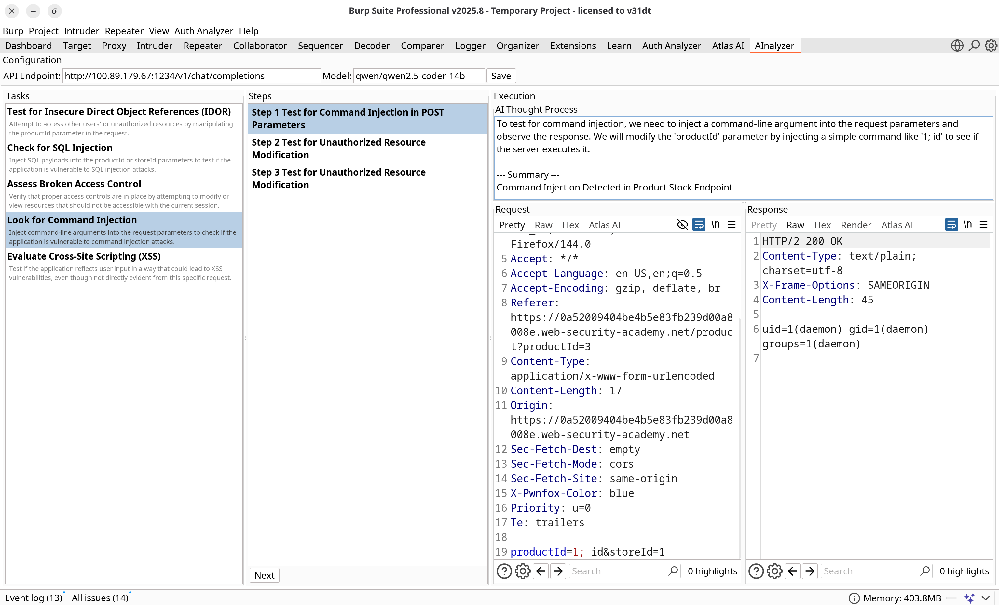

# AInalyzer

An open-source AI-powered Burp Suite extension that integrates an AI assistant for performing iterative security investigations on HTTP endpoints with human-in-the-loop oversight.

## Overview

AInalyzer augments penetration testing workflows by leveraging Large Language Models (LLMs) to automatically generate and execute security test cases against web endpoints. The extension identifies potential attack vectors, performs automated testing iterations, and adjusts its approach based on server responses—all while keeping the security professional in control of each step.



## Features

- 🤖 **AI-Driven Task Generation**: Automatically identifies potential vulnerabilities (IDOR, SQL injection, XSS, CSRF, etc.) based on endpoint analysis
- 🔄 **Iterative Testing**: Executes multiple test iterations with AI adapting its approach based on previous responses
- 👤 **Human-in-the-Loop**: Each testing step requires user approval via "Next" button
- 📊 **Three-Panel Interface**: 
  - **Tasks Panel**: AI-generated security testing objectives
  - **Steps Panel**: History of all executed test iterations
  - **Execution Panel**: Real-time AI reasoning, HTTP requests, and responses
- 🔌 **OpenAI-Compatible API**: Works with local LLMs (Ollama, LM Studio) and cloud providers
- 🎯 **Context-Aware**: Maintains conversation history across testing steps for intelligent follow-ups

## How It Works

1. **Select Target**: Right-click any HTTP request in Burp Suite and select "Send to AInalyzer"
2. **AI Analysis**: The extension analyzes the endpoint and generates 3-5 security testing tasks
3. **Iterative Execution**: 
   - Click "Next" to execute the first test
   - AI generates a modified request based on the task objective
   - Request is automatically sent; response is captured
   - AI summarizes findings and suggests next steps
4. **Repeat**: Continue clicking "Next" to perform additional tests, with AI adjusting tactics based on accumulated results

## Installation

### Prerequisites

- **Burp Suite Professional** (Community Edition not supported)
- **JDK 17 or higher**
- **AI Model**: Local LLM server (Ollama, LM Studio, etc.) or OpenAI-compatible API

### Building from Source

```
# Clone the repository
git clone https://github.com/jevsewooster1/ainalyzer/ainalyzer.git
cd ainalyzer

# Build with Gradle
./gradlew clean build

# The JAR file will be located at:
# build/libs/AInalyzer.jar
```

### Loading in Burp Suite

1. Open Burp Suite Professional
2. Navigate to **Extensions** → **Installed** → **Add**
3. **Extension Type**: Java
4. **Extension File**: Select `AInalyzer.jar`
5. Click **Next**, verify no errors in the output
6. Click **Close**

## Configuration

1. Open the **AInalyzer** tab in Burp Suite
2. Configure your AI provider:
   - **API Endpoint**: 
     - Ollama: `http://localhost:11434/v1/chat/completions`
     - LM Studio: `http://localhost:1234/v1/chat/completions`
     - OpenRouter: `https://openrouter.ai/api/v1/chat/completions`
   - **Model**: Model identifier (e.g., `llama3.1`, `qwen2.5`, `gpt-4`)
3. Click **Save**

### Recommended Models

- **Llama 3.1 8B** - Good balance of speed and quality
- **Qwen 2.5 14B** - Excellent reasoning for security tasks

## Usage Example

1. Intercept a POST request to /api/cart in Burp Proxy
2. Right-click → "Send to AInalyzer"
3. AI generates tasks:
   - IDOR: Unauthorized Product Addition
   - SQL Injection in productId Parameter
   - CSRF Token Validation Bypass
   - XSS via Redirect Parameter
4. Select "IDOR: Unauthorized Product Addition"
5. Click "Next" - AI tests productId=1 (instead of original productId=3)
6. Review response → Click "Next" - AI tries removing authentication
7. Review response → Click "Next" - AI attempts privilege escalation
8. Continue until vulnerability confirmed or test exhausted
