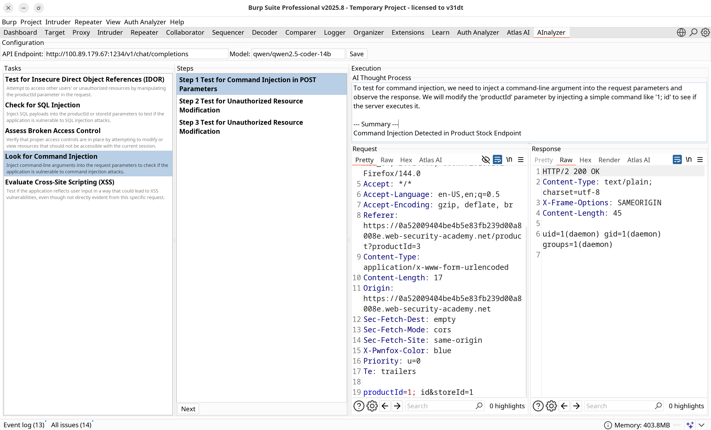

# AInalyzer

An open-source Burp Suite extension that uses an AI assistant to propose and execute iterative security tests against HTTP endpoints with analyst oversight.



## Overview

AInalyzer augments penetration testing workflows by using an AI assistant to generate and execute iterative security tests while keeping the analyst in control of each step.

## Features

- Generate 3 to 5 follow-up security tasks from a captured HTTP request/response pair
- Execute one AI-proposed test step at a time with analyst review between steps
- Show task history, generated requests, server responses, and AI summaries in one tab
- Keep prior step context for the selected task so the model can refine the next request
- Keep multiple request threads and a per-thread analyst/AI conversation history
- Work with OpenAI-compatible chat completion APIs
- Work with coding agents through AgentAPI

## Requirements

- Burp Suite Professional
- JDK 21 or newer
- An OpenAI-compatible API endpoint, OpenAI API key, or running AgentAPI server

## Build

```bash
./gradlew clean build
```

The extension JAR is produced under `build/libs/`.

## Load In Burp

1. Open Burp Suite Professional.
2. Go to `Extensions` -> `Installed` -> `Add`.
3. Choose extension type `Java`.
4. Select the built JAR from `build/libs/`.
5. Confirm the extension loads without errors.

## Configure

1. Open the `AInalyzer` tab in Burp.
2. Choose a provider preset.
3. Confirm or adjust the endpoint and model.
4. Enter an API key when using OpenAI.
5. Save the settings.

Provider presets:

- `Local / OpenAI-compatible`
  - for Ollama, LM Studio, and similar local servers
  - default endpoint: `http://localhost:11434/v1/chat/completions`
- `AgentAPI`
  - for an external AgentAPI server controlling Codex, Claude Code, Gemini, Aider, Goose, or another supported agent
  - default endpoint: `http://localhost:3284`
- `OpenAI`
  - default endpoint: `https://api.openai.com/v1/chat/completions`
  - requires bearer-token auth

Example models:

- Ollama: `llama3.1`, `qwen2.5`
- OpenAI: `gpt-5.2`, `gpt-5-mini`, `gpt-4.1`

## AgentAPI

AgentAPI must be installed and started separately before selecting the `AgentAPI` provider.

Install or update the latest `agentapi` binary:

```bash
OS=$(uname -s | tr "[:upper:]" "[:lower:]")
ARCH=$(uname -m | sed "s/x86_64/amd64/;s/aarch64/arm64/")
curl -fsSL "https://github.com/coder/agentapi/releases/latest/download/agentapi-${OS}-${ARCH}" -o agentapi
chmod +x agentapi
```

Verify the installation:

```bash
./agentapi --help
```

```bash
agentapi server --type=codex -- codex
```

By default AgentAPI listens on `http://localhost:3284`. AInalyzer uses:

- `GET /status`
- `POST /message`
- `GET /messages`

## How It Works

1. Right-click an HTTP request in Burp Suite and select `Send to AInalyzer`.
2. AInalyzer analyzes the request/response pair and generates 3 to 5 tasks.
3. Select a task and click `Next` to execute the next AI-proposed step.
4. Review the generated request, response, summary, and conversation history before continuing.

## Usage

1. Capture or open a request in Burp.
2. Right-click and choose `Send to AInalyzer`.
3. Wait for the extension to generate tasks.
4. Select a task and click `Next` to execute the next proposed step.
5. Review the generated request, response, and summary before continuing.

## Development Notes

- The project currently targets Java 21.
- Tests use JUnit 5.
- Some provider-specific chat completion quirks may require prompt or response-format adjustments.
